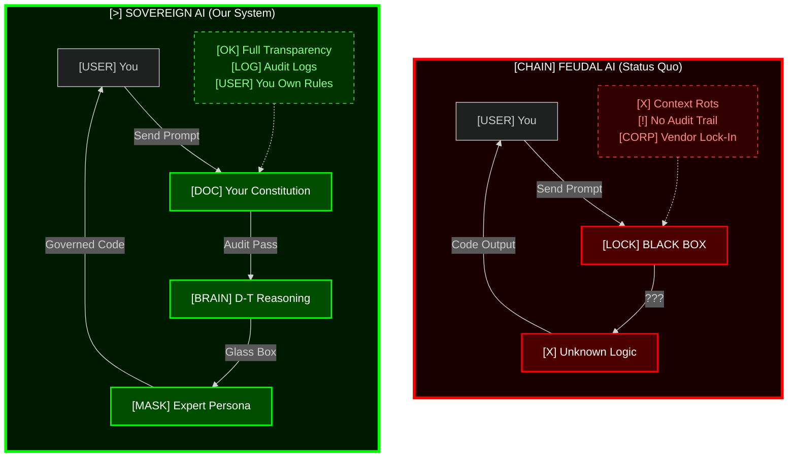

# Sovereign Intelligence Engine & Ops

# Sovereign Intelligence Stack

**Escape Digital Feudalism. Own Your AI.**

---

## [>] The Kill Sheet: Why This Exists



| Attribute | [CHAIN] Feudal AI | [>] Sovereign AI |
|-----------|--------------|-----------------|
| **Visibility** | [LOCK] Black Box | [VIEW] Glass Box |
| **Control** | [CORP] Vendor-Owned | [USER] User-Owned |
| **Rules** | [?] Opaque | [DOC] YAML Constitution |
| **Agency** | [BOT] AI Decides | [BRAIN] Human Governs |
| **Context** | [X] Entropy (Rots) | [LOG] Preserved (Logged) |

---

## [DIR] The Repository Structure

This repository is organized into the three pillars of Sovereignty:

### 1. [BRAIN] The Cortex (`/cortex`)

**The Soul of the System.**

- `/personas`: System prompts treated as role-based configuration (e.g., `senior_architect.md`).
- `/library`: Static knowledge bases and context files (e.g., `style_guide.md`).
- `/memory`: Long-term vector storage and interaction logs.

### 2. [SCALE] The Constitution (`/config`)

**The Law of the Land.**

- `constitution.yaml`: The governance file defining safety rails, privacy rules, and agency tiers.
- `model_routing.json`: Configuration for Model Arbitrage (routing tasks to OpenAI, Anthropic, or Local Llama based on cost/privacy).

### 3. [>] The Engine (`/engine`)

**The Machinery.**

- **Stateless MCP Server**: The Python/Rust core that processes intent, tools, and retrieval.
- **Workflows**: Repeatable cognitive chains (e.g., `refactor_module.flow`).

---

## [DOC] Documentation Index

### Phase 1: The Philosophy (Why we build)

- **[The Manifesto](MANIFESTO.md)**: The argument against Digital Feudalism.
- **[The Dialectic](docs/DIALECTIC.md)**: Thesis, Antithesis, and Synthesis.

### Phase 2: The Architecture (What we build)

- **[The Scaffold](docs/The_Sovereign_Scaffold.md)**: The directory structure standard.
- **[The Dictionary](docs/Dictionary_of_Cognitive_Sovereignty.md)**: Common vocabulary (e.g., "Model Drift", "Glass Box").
- **[SovereignOps](docs/SovereignOps.md)**: The Human-in-the-Loop collaboration guide.
- **[Ironman Defense](docs/The_Adversarial_Defense.md)**: Rebuttals to common objections.

### Phase 3: The Migration (How to adopt)

- **[Migration Manual](docs/workshops/Sovereign_Migration_Manual.md)**: From Tenant to Owner.
- **[30-Day Roadmap](docs/workshops/30_Day_Roadmap.md)**: The implementation schedule.
- **[Starter Templates](templates/)**: Copy-paste configurations for `constitution.yaml` and Personas.

---

## [DOC] Documentation

- **[User Guide](USER_GUIDE.md)** - Complete guide on how to use the system
- **[Manifesto](MANIFESTO.md)** - The philosophy behind Sovereign Intelligence
- **[Architecture Docs](docs/)** - Deep technical documentation

---

## [>] Quick Start (Zero to Sovereign)

### 1. Initialize the Stack

```bash
git clone https://github.com/hummbl-dev/engine-ops.git
cd engine-ops
```

### 2. Setup the Engine

```bash
cd engine
python3 -m venv venv
source venv/bin/activate
pip install -r requirements.txt

# Create .env file with your API key
echo "GOOGLE_API_KEY=your_api_key_here" > .env
```

### 3. Start the Engine

```bash
uvicorn src.main:app --host 0.0.0.0 --port 8080 --reload
```

### 4. Access the Matrix UI

Open `http://localhost:8080/docs` in your browser to see the Matrix-themed API interface.

### 5. Test the API

Try the `/consult` endpoint with:
```json
{
  "topic": "How should I handle team burnout?",
  "member": "marcus_aurelius"
}
```

**For detailed instructions, see [USER_GUIDE.md](USER_GUIDE.md)**

---

## [*] What's Included

### The Engine (`engine/`)

- **FastAPI Server** - RESTful API with Matrix-themed Swagger UI
- **Sovereign Council** - Three expert personas (Sun Tzu, Marcus Aurelius, Machiavelli)
- **Gemini Integration** - Real LLM-powered advice generation
- **Constitutional Auditing** - Safety and agency preservation rules

### The Extension (`extension/`)

- **VS Code Chat Integration** - `@hummbl` chat participant
- **Dynamic Intent Routing** - Automatically extracts member and topic from natural language
- **MCP Protocol** - Model Context Protocol for engine communication

### The UI

- **Matrix Theme** - Raw hacker aesthetic with customizable intensity
- **Terminal Interface** - Command-line overlay for power users
- **Keyboard Shortcuts** - Full keyboard navigation support
- **Interactive Docs** - Swagger UI with Matrix styling

---

## [DOC] Learn More

- **[USER_GUIDE.md](USER_GUIDE.md)** - Complete user manual with examples
- **[API Reference](USER_GUIDE.md#-api-reference)** - All endpoints documented
- **[Troubleshooting](USER_GUIDE.md#-troubleshooting)** - Common issues and solutions

---

## [HAND] Contributing

We follow **SovereignOps** protocols:

- **Augmented Commits**: All AI-generated code must verify provenance in the commit message.
- **Constitutional Audits**: No PR merges without passing `.eval` safety checks.
- **Context Hygiene**: Weekly pruning of vector memory to prevent "Context Rot."

---

**You are not a tenant. You are the Sovereign.**

Welcome to the age of Owned Intelligence.
