# Sovereign Intelligence Engine & Ops

# Sovereign Intelligence Stack

**Escape Digital Feudalism. Own Your AI.**

---

## ⚡ The Kill Sheet: Why This Exists

```mermaid
graph TB
    subgraph FEUDAL["⛓️ THE FEUDAL LOOP (Status Quo)"]
        F_User["👤 Developer"] -->|"Prompt"| F_Black["🔒 BLACK BOX<br/>(Closed Model)"]
        F_Black -->|"No visibility"| F_Decision["❓ Decision Logic<br/>(Hidden)"]
        F_Decision -->|"No control"| F_Vendor["🏢 Vendor Lock-In<br/>(OpenAI/Anthropic)"]
        F_Vendor -->|"Code"| F_User
        
        F_Rot["💀 Context Rot"] -.->|"Fragments over time"| F_Black
        F_Trust["⚠️ Trust Erosion"] -.->|"No audit trail"| F_Decision
    end

    subgraph SOVEREIGN["⚡ THE SOVEREIGN STACK (Our System)"]
        S_User["👤 Sovereign Operator"] -->|"Prompt"| S_Const["📜 Constitution<br/>(Your Rules)"]
        S_Const -->|"Audit"| S_DT["🧠 D-T Framework<br/>(Transparent Reasoning)"]
        S_DT -->|"Glass Box"| S_Persona["🎭 Persona Layer<br/>(Expert Modes)"]
        S_Persona -->|"Governed Output"| S_User
        
        S_History["📝 Full History"] -.->|"Audit trail"| S_Const
        S_Agency["✅ Human Agency"] -.->|"You own the rules"| S_DT
    end

    style FEUDAL fill:#2d0d0d,stroke:#ff4444,stroke-width:3px,color:#fff
    style SOVEREIGN fill:#0d2d0d,stroke:#44ff44,stroke-width:3px,color:#fff
    
    style F_Black fill:#330000,stroke:#ff0000,color:#fff
    style F_Decision fill:#330000,stroke:#ff0000,color:#fff
    style F_Vendor fill:#330000,stroke:#ff0000,color:#fff
    
    style S_Const fill:#003300,stroke:#00ff00,color:#fff
    style S_DT fill:#003300,stroke:#00ff00,color:#fff
    style S_Persona fill:#003300,stroke:#00ff00,color:#fff
    
    style F_Rot fill:#660000,stroke:#ff0000,stroke-dasharray: 5 5
    style F_Trust fill:#660000,stroke:#ff0000,stroke-dasharray: 5 5
    style S_History fill:#006600,stroke:#00ff00,stroke-dasharray: 5 5
    style S_Agency fill:#006600,stroke:#00ff00,stroke-dasharray: 5 5
```



| Attribute | ⛓️ Feudal AI | ⚡ Sovereign AI |
|-----------|--------------|-----------------|
| **Visibility** | 🔒 Black Box | 🔍 Glass Box |
| **Control** | 🏢 Vendor-Owned | 👤 User-Owned |
| **Rules** | ❓ Opaque | 📜 YAML Constitution |
| **Agency** | 🤖 AI Decides | 🧠 Human Governs |
| **Context** | 💀 Entropy (Rots) | 📝 Preserved (Logged) |

---

## Repository Overview Architecture: Feudalism vs. Sovereignty

```mermaid
graph TD
    subgraph FEUDAL ["❌ THE FEUDAL LOOP (Status Quo)"]
        U1[User] -->|Prompts & Data| API[Centralized Black Box]
        API -->|Opaque Logic| U1
        API -.->|Harvesting| TRAINING[Vendor Training Data]
        style FEUDAL fill:#f9f9f9,stroke:#333,stroke-width:2px,stroke-dasharray: 5 5
    end

    subgraph SOVEREIGN ["✅ THE SOVEREIGN STACK (Hummbl)"]
        U2[User] -->|Intent| KERNEL[Sovereign Kernel]
        
        subgraph CORTEX [The Cortex]
            CONST[Constitution.yaml]
            MEM[Local Memory]
        end
        
        KERNEL -->|Audit| CONST
        KERNEL -->|Retrieval| MEM
        
        KERNEL -->|Safe Request| ROUTER{Router}
        ROUTER -->|Reasoning| CLAUDE[Claude-3]
        ROUTER -->|Privacy| LOCAL[Local Llama-3]
        
        CLAUDE -->|Raw Token| KERNEL
        LOCAL -->|Raw Token| KERNEL
        
        KERNEL -->|Verified Output| U2
        style SOVEREIGN fill:#e1f5fe,stroke:#01579b,stroke-width:2px
    end
```



**The Difference:** In the Feudal model, you feed the machine. In the Sovereign model, the machine feeds you—but only after your Constitution approves it.

---

## 📂 The Repository Structure

This repository is organized into the three pillars of Sovereignty:

### 1. 🧠 The Cortex (`/cortex`)

**The Soul of the System.**

- `/personas`: System prompts treated as role-based configuration (e.g., `senior_architect.md`).
- `/library`: Static knowledge bases and context files (e.g., `style_guide.md`).
- `/memory`: Long-term vector storage and interaction logs.

### 2. ⚖️ The Constitution (`/config`)

**The Law of the Land.**

- `constitution.yaml`: The governance file defining safety rails, privacy rules, and agency tiers.
- `model_routing.json`: Configuration for Model Arbitrage (routing tasks to OpenAI, Anthropic, or Local Llama based on cost/privacy).

### 3. ⚡ The Engine (`/engine`)

**The Machinery.**

- **Stateless MCP Server**: The Python/Rust core that processes intent, tools, and retrieval.
- **Workflows**: Repeatable cognitive chains (e.g., `refactor_module.flow`).

---

## 📖 Documentation Index

### Phase 1: The Philosophy (Why we build)

- **[The Manifesto](MANIFESTO.md)**: The argument against Digital Feudalism.
- **[The Dialectic](docs/DIALECTIC.md)**: Thesis, Antithesis, and Synthesis.

### Phase 2: The Architecture (What we build)

- **[The Scaffold](docs/The_Sovereign_Scaffold.md)**: The directory structure standard.
- **[The Dictionary](docs/Dictionary_of_Cognitive_Sovereignty.md)**: Common vocabulary (e.g., "Model Drift", "Glass Box").
- **[SovereignOps](docs/SovereignOps.md)**: The Human-in-the-Loop collaboration guide.
- **[Ironman Defense](docs/The_Adversarial_Defense.md)**: Rebuttals to common objections.

### Phase 3: The Migration (How to adopt)

- **[Migration Manual](docs/workshops/Sovereign_Migration_Manual.md)**: From Tenant to Owner.
- **[30-Day Roadmap](docs/workshops/30_Day_Roadmap.md)**: The implementation schedule.
- **[Starter Templates](templates/)**: Copy-paste configurations for `constitution.yaml` and Personas.

---

## ⚡ Quick Start (Zero to Sovereign)

### 1. Initialize the Stack

```bash
git clone https://github.com/hummbl-dev/engine-ops.git
cd engine-ops
cp templates/config/constitution.yaml config/
cp templates/personas/senior_architect.md cortex/personas/
```

### 2. Configure the Router

Edit `config/model_routing.json` to point to your preferred providers (Local or Cloud).

### 3. Run the Engine

```bash
# Example: Run a safe refactor using the Architect persona
sovereign run workflow refactor_module --target src/main.py
```

---

## 🤝 Contributing

We follow **SovereignOps** protocols:

- **Augmented Commits**: All AI-generated code must verify provenance in the commit message.
- **Constitutional Audits**: No PR merges without passing `.eval` safety checks.
- **Context Hygiene**: Weekly pruning of vector memory to prevent "Context Rot."

---

**You are not a tenant. You are the Sovereign.**

Welcome to the age of Owned Intelligence.
