# The Kill Sheet: Feudal vs. Sovereign Architecture

This is the visual asset for social media, presentations, and README shock value.

## The Comparison Diagram

```mermaid
graph TB
    subgraph FEUDAL["⛓️ THE FEUDAL LOOP (Status Quo)"]
        F_User["👤 Developer"] -->|"Prompt"| F_Black["🔒 BLACK BOX<br/>(Closed Model)"]
        F_Black -->|"No visibility"| F_Decision["❓ Decision Logic<br/>(Hidden)"]
        F_Decision -->|"No control"| F_Vendor["🏢 Vendor Lock-In<br/>(OpenAI/Anthropic)"]
        F_Vendor -->|"Code"| F_User
        
        F_Rot["💀 Context Rot"] -.->|"Fragments over time"| F_Black
        F_Trust["⚠️ Trust Erosion"] -.->|"No audit trail"| F_Decision
    end

    subgraph SOVEREIGN["⚡ THE SOVEREIGN STACK (Our System)"]
        S_User["👤 Sovereign Operator"] -->|"Prompt"| S_Const["📜 Constitution<br/>(Your Rules)"]
        S_Const -->|"Audit"| S_DT["🧠 D-T Framework<br/>(Transparent Reasoning)"]
        S_DT -->|"Glass Box"| S_Persona["🎭 Persona Layer<br/>(Expert Modes)"]
        S_Persona -->|"Governed Output"| S_User
        
        S_History["📝 Full History"] -.->|"Audit trail"| S_Const
        S_Agency["✅ Human Agency"] -.->|"You own the rules"| S_DT
    end

    style FEUDAL fill:#2d0d0d,stroke:#ff4444,stroke-width:3px,color:#fff
    style SOVEREIGN fill:#0d2d0d,stroke:#44ff44,stroke-width:3px,color:#fff
    
    style F_Black fill:#330000,stroke:#ff0000,color:#fff
    style F_Decision fill:#330000,stroke:#ff0000,color:#fff
    style F_Vendor fill:#330000,stroke:#ff0000,color:#fff
    
    style S_Const fill:#003300,stroke:#00ff00,color:#fff
    style S_DT fill:#003300,stroke:#00ff00,color:#fff
    style S_Persona fill:#003300,stroke:#00ff00,color:#fff
    
    style F_Rot fill:#660000,stroke:#ff0000,stroke-dasharray: 5 5
    style F_Trust fill:#660000,stroke:#ff0000,stroke-dasharray: 5 5
    style S_History fill:#006600,stroke:#00ff00,stroke-dasharray: 5 5
    style S_Agency fill:#006600,stroke:#00ff00,stroke-dasharray: 5 5
```



## Side-by-Side Comparison Table

| Attribute | ⛓️ Feudal AI | ⚡ Sovereign AI |
|-----------|--------------|-----------------|
| **Visibility** | 🔒 Black Box | 🔍 Glass Box |
| **Control** | 🏢 Vendor-Owned | 👤 User-Owned |
| **Rules** | ❓ Opaque | 📜 YAML Constitution |
| **Agency** | 🤖 AI Decides | 🧠 Human Governs |
| **Context** | 💀 Entropy (Rots) | 📝 Preserved (Logged) |
| **Trust** | ⚠️ Blind Faith | ✅ Cryptographic Proof |
| **Adaptation** | 🐌 Wait for Vendor | ⚡ Edit Config Today |
| **Cost** | 💰 Rent Forever | 🏗️ Own Infrastructure |

## The Visceral Truth

**Feudal AI:**

```
You → [???????] → Code
      ↑
   (What happened here?)
```

**Sovereign AI:**

```
You → [Constitution] → [D-T Reasoning] → [Persona] → Code
      ↑                ↑                  ↑
   (Your Rules)    (Visible Logic)   (Audit Log)
```

## Social Media Copy

### Twitter/X Thread Starter

```
🧵 I built a firewall for my mind.

Your AI assistant is a black box. You have no idea why it suggests what it suggests, no control over its behavior, and no record of what it's doing to your codebase.

This is Digital Feudalism. And I'm done with it.

[Image: The Kill Sheet]
```

### HN Title Options

1. "Show HN: Sovereign Intelligence – A Constitutional Firewall for AI Assistants"
2. "I built a Glass-Box AI that enforces my rules, not theirs"
3. "Sovereign Intelligence: Escaping Digital Feudalism with Constitutional AI"

## README Hero Placement

Insert this at the top of the main README, right after the title:

```markdown
# Sovereign Intelligence Stack

**Escape Digital Feudalism. Own Your AI.**


> "You cannot change one variable without vibrating the entire web."
```

## Design Notes

**Color Psychology:**

- Red (Feudal): Danger, lock-in, hidden
- Green (Sovereign): Growth, transparency, freedom
- Icons with meaning:
  - ⛓️ Chains = Feudalism
  - ⚡ Lightning = Sovereignty
  - 🔒 Lock = Closed
  - 🔍 Magnifying Glass = Transparent
  - 💀 Skull = Context Rot
  - ✅ Checkmark = Agency

**Dark Mode Optimized:** All colors chosen for maximum contrast on GitHub dark theme and Twitter dark mode.

**Meme Potential:** The "What happened here?" ASCII art is screenshot-friendly and inherently shareable.
