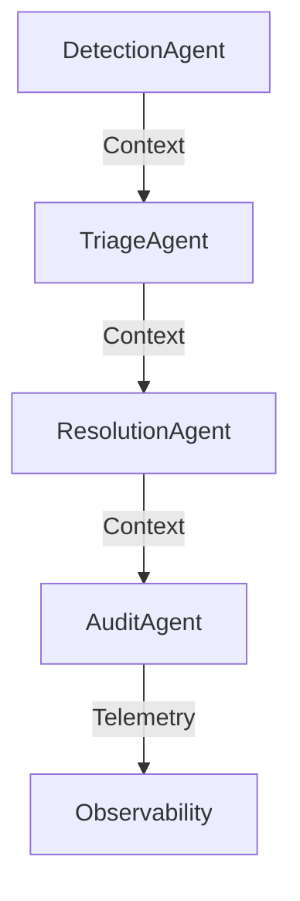

# Engine-Ops Documentation

> **Version:** v1.0  
> **Last updated:** 2025-11-24  
> **Changelog:** Major expansion—technical onboarding, troubleshooting, compatibility, and product guidance.

---

**See also:**

- [Non-Technical Overview](engine-ops-overview-non-technical.md)
- [Onboarding Quickstart](onboarding-quickstart.md)
- [Copilot Instructions](../.github/copilot-instructions.md)

---

## Limitations & Compatibility

- **Operating System Support:**
  - Engine-Ops is tested on recent macOS, Windows, and Linux releases.
  - Older OS versions (e.g., macOS 13) may have limited support for Homebrew, Python, Terraform, and other dependencies.
  - For unsupported systems, consider MacPorts or manual installation.
- **Hardware Requirements:**
  - Recommended: Multi-core CPU, 8GB+ RAM for local development; cloud or dedicated servers for production/staging.
- **Tool Licensing & Deprecation:**
  - Python@3.9 and open-source Terraform are deprecated; future updates may require manual management or migration to alternatives.
  - Monitor upstream changes for critical dependencies.
- **Troubleshooting:**
  - See the Troubleshooting & FAQ section for common issues, version mismatches, and environment setup tips.

## Onboarding Guidance

- **Local Setup:**
  1. Install Node.js, Python, Git, Helm, Terraform (see [Onboarding Quickstart](onboarding-quickstart.md)).
  2. Clone the repo and run `npm install`, `pytest agentic_workflow/tests/`.
  3. Validate environment with `npm run lint` and test commands.
- **Cloud Deployment:**
  1. Use Helm charts, Kubernetes manifests, and Terraform scripts in `infra/`.
  2. Ensure cloud credentials and permissions are configured.
- **Hybrid Use:**
  1. Mix local and cloud resources; agents communicate via context propagation.
  2. Review environment support and integration points in technical docs.

## Support & Feedback

- Open issues in the repository for help.
- Community resources and technical documentation in `docs/`.
- Feedback is welcome for onboarding and product improvements.

## Learn More

- See the full technical documentation for architecture, agent lifecycle, and advanced troubleshooting.
- Explore onboarding quickstart and troubleshooting tips for smooth setup.

## Table of Contents

1. What is Engine-Ops?
2. Architecture & Components
3. Agent Lifecycle Diagram
4. AgentContext Types
5. Policy Engine
6. Environment Support
7. Security & Compliance
8. Observability & Monitoring
9. Extensibility & Plugins
10. CI/CD & Developer Workflow
11. Troubleshooting & FAQ
12. Order of Operations
13. Golden Use Cases (Technical)
14. Golden Use Cases (Non-Technical)
15. Onboarding & Products for Non-Technical Users
16. Requirements
17. References

## What is Engine-Ops?

Engine-Ops is a vendor-agnostic, multi-agent workflow system for operational optimization, context management, and automation. It supports local, cloud, and hybrid deployments, enabling high reliability and traceability for complex environments.

## Architecture

**Multi-agent system:** Python (`agentic_workflow/`) and TypeScript (`core/`) engines coordinate agents for detection, triage, resolution, and audit.

**Context-first design:** Rich `AgentContext` object flows between agents, enforcing policies and logging telemetry.

**Extensible:** Add agents by subclassing `agent_base.py` and implementing `process(context)`.

**Plugin/provider pattern:** Extend via `core/plugins/` (TypeScript) or ML plugins (`examples/ml-plugin/`).

**Observability:** Telemetry hooks for distributed tracing and Prometheus metrics.

### Agent Lifecycle Diagram



## AgentContext Types

Engine-Ops uses a rich `AgentContext` object with 15 context types. Each type enables agents to make decisions with full awareness of operational, security, and business requirements:

1. **IdentityContext** – Who is executing the workflow (Agent ID, User ID, Organization ID, roles)

   Example:

   ```json
   { "agent_id": "detector-1", "role": "anomaly-detection" }
   ```

2. **StateContext** – Current and previous workflow state, transition history

   Example:

   ```json
   { "state": "triage", "history": ["detected", "triage"] }
   ```

3. **SessionContext** – Session-level tracking (session ID, creation time, TTL)

   Example:

   ```json
   { "session_id": "abc123", "ttl": 3600 }
   ```

4. **IntentContext** – Goals, objectives, priority levels

   Example:

   ```json
   { "intent": "resolve-incident", "priority": "high" }
   ```

5. **PolicyContext** – Compliance, applicable policies, escalation rules

   Example:

   ```json
   { "policy": "access-control", "escalation": "critical" }
   ```

6. **TelemetryContext** – Observability (trace IDs, metrics, events)

   Example:

   ```json
   { "trace_id": "xyz789", "metrics": { "latency": 120 } }
   ```

7. **KnowledgeContext** – Learned facts, recommendations, confidence scores

   Example:

   ```json
   { "facts": ["CPU spike"], "confidence": 0.95 }
   ```

8. **DependenciesContext** – System relationships, upstream/downstream services

   Example:

   ```json
   { "upstream": "db", "downstream": "api" }
   ```

9. **AnnotationContext** – Tags, labels, human-readable notes

   Example:

   ```json
   { "tags": ["urgent", "security"], "notes": "Reviewed by SRE" }
   ```

10. **SecurityContext** – Encryption, data classification, sensitive field tracking

    Example:

    ```json
    { "classification": "confidential", "encrypted": true }
    ```

11. **ResourceContext** – Resource allocation, cost tracking

    Example:

    ```json
    { "cpu": 2, "memory": "4GB", "cost": 0.1 }
    ```

12. **TemporalContext** – Time management (start time, deadline, duration)

    Example:

    ```json
    { "start": "2025-11-24T10:00Z", "deadline": "2025-11-24T12:00Z" }
    ```

13. **PayloadContext** – Data being processed (input, output, intermediate results)

    Example:

    ```json
    { "input": "logfile.txt", "output": "summary.json" }
    ```

14. **RelationshipContext** – Parent/child workflow relationships, correlation IDs

    Example:

    ```json
    { "parent_id": "workflow-42", "correlation_id": "xyz" }
    ```

15. **TopologyContext** – Infrastructure info (region, cluster, node)

    Example:

    ```json
    { "region": "us-west1", "cluster": "prod-cluster" }
    ```

## Policy Engine

Engine-Ops features a robust policy engine for runtime compliance, access control, and escalation management:

- **Rule-based evaluation:** Policies are defined as conditions with actions (Allow, Deny, Escalate, Log, Require Approval).
- **Priority-based execution:** Higher priority rules are evaluated first, ensuring critical policies are enforced promptly.
- **Escalation levels:** Info, Warning, Critical, Emergency—each with custom handling logic.
- **Handler registration:** Custom escalation handlers can be registered in `policy.py` to automate responses or require manual approval.
- **Audit trail:** Every policy decision is logged, providing a full history for compliance and troubleshooting.

Example Policy Definition:

```python
policy = {
    "name": "High Privilege Access",
    "condition": "user.role == 'admin' and action == 'delete'",
    "action": "Require Approval",
    "escalation": "critical"
}
```

See `agentic_workflow/policy.py` for implementation details and customization options.

## Environment Support

Engine-Ops supports flexible deployment models:

- **Local:**
  - Run all components on a developer machine.
  - Requirements: Node.js 18+, Python 3.9+, Bash 4.0+.
  - Setup:

    ```sh
    git clone https://github.com/hummbl-dev/engine-ops.git
    cd engine-ops
    npm install
    pytest agentic_workflow/tests/
    ```

  - Common issues: Missing dependencies, Python/Node version mismatches.

- **Cloud:**
  - Deploy via Helm charts (`infra/helm/`), Kubernetes manifests (`infra/k8s/`), and Terraform (`infra/terraform/`).
  - Supports GKE/GCP, multi-cloud, and blue-green deployments.
  - Setup:

    ```sh
    helm install engine-ops ./infra/helm/engine-ops
    kubectl apply -f infra/k8s/
    terraform apply infra/terraform/
    ```

  - Common issues: Cloud provider credentials, network/firewall configuration, resource quotas.

- **Hybrid:**
  - Mix local and cloud resources; context and agents communicate across boundaries.
  - Example: Run agents locally, connect to cloud-managed databases or services.

### Troubleshooting Tips

- Ensure all prerequisites are installed and versions match requirements.
- For cloud deployments, verify credentials and access permissions.
- Check logs in `agentic_workflow/telemetry.py` and cloud monitoring dashboards for errors.
- For network issues, confirm firewall rules and service endpoints.
- See `infra/README.md` for more details and advanced configuration.

## Security & Compliance

Engine-Ops is designed for secure, compliant operations in regulated and enterprise environments:

- **Policy enforcement:** All agent actions are validated against runtime policies (see `agentic_workflow/policy.py`).
- **Escalation and approval:** Sensitive actions trigger escalation workflows and may require manual approval.
- **Audit trails:** All agent lifecycle events and policy decisions are logged via telemetry for full traceability.
- **Secure deployment:** Supports encrypted secrets, RBAC, and cloud-native security features (Kubernetes, IAM, etc.).
- **Compliance:** Designed to support SOC2, GDPR, and other regulatory frameworks through context tagging and audit logging.

Best Practices:

- Always review and update policies for new agents and integrations.
- Use encrypted channels and secrets for all cloud deployments.
- Regularly audit logs and telemetry for compliance and security events.

## Observability & Monitoring

Engine-Ops provides full observability for distributed workflows and agent operations:

- **Telemetry hooks:** All agent lifecycle events, context transitions, and policy decisions are logged for distributed tracing (see `agentic_workflow/telemetry.py`).
- **Metrics:** Prometheus metrics are exposed via TypeScript core (`core/observability/metrics.ts`) and can be visualized in Grafana.
- **Monitoring stack:** Deploy Prometheus/Grafana via Helm (`infra/helm/monitoring/`) for real-time monitoring and alerting.
- **Log summarization:** Use tools in `tools/log-summarizer.ts` to aggregate and analyze logs for anomaly detection and compliance.

Best Practices:

- Enable telemetry for all custom agents and plugins.
- Regularly review metrics dashboards for performance and reliability.
- Set up alerts for critical events and policy escalations.

## Extensibility & Plugins

Engine-Ops is designed for easy extension and integration:

- **Agent extensibility:** Add new agents by subclassing `agent_base.py` and implementing `process(context)`.
- **Plugin architecture:** Extend the TypeScript core via `core/plugins/` or add custom ML plugins in `examples/ml-plugin/`.
- **Provider pattern:** Use provider interfaces for AI, credentials, and cloud integrations to support multiple backends.
- **Cross-language support:** Integrate Python and TypeScript plugins for advanced ML and automation workflows.

Best Practices:

- Follow existing agent and plugin patterns for consistency and maintainability.
- Register new plugins and providers in the appropriate directories.
- Document new extensions and update relevant READMEs for discoverability.

## CI/CD & Developer Workflow

Engine-Ops supports modern development workflows for rapid iteration and high code quality:

- **Build TypeScript:**

  ```sh
  npm run build
  ```

- **Run TypeScript tests:**

  ```sh
  npm test
  ```

- **Run Python tests:**

  ```sh
  pytest agentic_workflow/tests/
  ```

- **Lint TypeScript:**

  ```sh
  npm run lint
  ```

- **License header management:**

  ```sh
  ./tools/apply-license-headers.sh
  ```

- **Contribute:**
  - Follow directory licensing boundaries (see `README.md`).
  - Add license headers to all source files.
  - Maintain high test coverage and update tests for new features.
  - Document new features and update relevant READMEs.
- **CI/CD pipeline:**
  - Automated builds and tests via GitHub Actions (see `.github/workflows/`).
  - Continuous integration for all pull requests and merges.

Best Practices:

- Run tests and lint before submitting changes.
- Use feature branches and pull requests for all new work.
- Review CI/CD status and address failures promptly.

## Troubleshooting & FAQ

### Common Issues

- **Missing dependencies:**
  - Ensure Node.js, Python, Bash, Helm, and Terraform are installed and meet version requirements.
- **Build failures:**
  - Check for missing packages (`npm install`, `pip install -e .`).
  - Verify TypeScript and Python versions.
- **Test failures:**
  - Run tests individually to isolate issues.
  - Check for outdated fixtures or missing test data.
- **Cloud deployment errors:**
  - Verify cloud provider credentials and permissions.
  - Check network/firewall rules and resource quotas.
- **Telemetry/logging issues:**
  - Ensure telemetry is enabled for all agents.
  - Review logs in `agentic_workflow/telemetry.py` and cloud dashboards.

### Frequently Asked Questions

- **Can I run Engine-Ops locally without cloud dependencies?**
  - Yes, all core features work locally with the required dependencies.
- **How do I add a new agent or plugin?**
  - Subclass `agent_base.py` for Python agents, or add plugins in `core/plugins/` for TypeScript.
- **What licensing applies to my code contributions?**
  - Follow directory-based licensing (see `README.md`).
- **How do I monitor and debug workflows?**
  - Use Prometheus/Grafana dashboards and log summarization tools.
- **Where can I find more documentation?**
  - See referenced READMEs and the `docs/` directory for guides and examples.

For additional help, consult the relevant README files or open an issue in the repository.

## Expanded Troubleshooting & FAQ (Draft)

To further support users, Engine-Ops will expand troubleshooting and FAQ coverage:

- **Detailed troubleshooting guides:**
  - Step-by-step solutions for common setup, build, test, and deployment errors.
  - Environment validation scripts and checklists for OS, hardware, and dependencies.
  - Diagnostic commands and log file locations for rapid issue resolution.

- **Advanced FAQ topics:**
  - How to resolve cloud credential and network issues.
  - Best practices for agent extensibility and plugin registration.
  - Security, compliance, and audit troubleshooting.
  - How to interpret telemetry, metrics, and audit logs.

- **Pre-integration checks:**
  - Automated preflight checks before enabling new integrations or marketplace connections.
  - Compatibility matrix for supported tools and platforms.
  - Guidance for reporting issues and requesting new integrations.

This section will be expanded with scripts, checklists, and troubleshooting scenarios as development progresses.

## Order of Operations for Agentic Workflows

Engine-Ops agents should follow this recommended sequence to ensure context-aware, policy-compliant, and traceable operations:

1. **Intent Formation**
   - Define operational goals, priorities, and constraints using `IntentContext`.
2. **Intent Discovery & Validation**
   - Propagate context to relevant agents.
   - Validate and refine intent through agent collaboration and context enrichment.
3. **Context Propagation**
   - Ensure all agents receive the full, updated `AgentContext` (including intent, state, policy, etc.).
4. **Policy Enforcement**
   - Validate context and intended actions against runtime policies.
   - Handle escalation and approvals as needed.
5. **Prompt/Code Authoring**
   - Generate or select prompts, code, or actions based on the validated intent and context.
6. **Agent Action & Execution**
   - Agents process the context and execute their assigned tasks.
7. **Telemetry & Audit Logging**
   - Log all lifecycle events, decisions, and actions for observability and compliance.
8. **Result Aggregation & Feedback**
   - Aggregate results, update context, and provide feedback for further intent refinement or next steps.

This order ensures all agent actions are context-driven, policy-compliant, and fully auditable.

## Golden Use Cases for Technical Users

Engine-Ops is designed to support a range of advanced, context-driven automation and optimization scenarios. Key use cases include:

1. **Automated Incident Detection and Resolution**
   - DetectionAgent identifies anomalies in telemetry data.
   - TriageAgent prioritizes incidents and assigns resolution paths.
   - ResolutionAgent executes remediation steps, supports rollback, and tracks success.
   - AuditAgent logs all actions for compliance and reporting.

2. **Policy-Driven Access Control and Compliance**
   - Agents validate all actions against runtime policies (e.g., access control, escalation).
   - Sensitive operations trigger approval workflows and audit logging.
   - Full traceability for regulatory compliance (SOC2, GDPR, etc.).

3. **Multi-Cloud and Hybrid Workflow Orchestration**
   - Deploy agents across local and cloud environments.
   - Use context propagation to coordinate distributed workflows and resource management.
   - Integrate with cloud-native services (Kubernetes, IAM, monitoring).

4. **ML-Driven Optimization and Prediction**
   - Register custom ML plugins to analyze workload patterns and make optimization recommendations.
   - Collect training data, run predictions, and automate resource allocation.
   - Integrate Python and TypeScript ML models for advanced scenarios.

5. **Zero-Downtime Deployments and Blue-Green Releases**
   - Use infrastructure automation (Helm, Terraform, Kubernetes) to deploy updates without service interruption.
   - Agents coordinate traffic switching, health checks, and rollback procedures.

6. **Context-Aware Prompt Engineering and Automation**
   - Author prompts and automation scripts that adapt to real-time context and intent.
   - Use context types (IntentContext, StateContext, etc.) to drive dynamic agent behavior.

These use cases exemplify the power and flexibility of Engine-Ops for technical teams building robust, scalable, and compliant automation solutions.

## Golden Use Cases for Non-Technical Users (Learning to Become Technical)

Engine-Ops empowers non-technical users to gradually build automation and operational skills. Key use cases include:

1. **Automated System Health Monitoring**
   - Use built-in agents to monitor system status and receive alerts for issues.
   - Learn how context and telemetry help agents make decisions.

2. **Simple Workflow Automation**
   - Trigger basic tasks (e.g., backup, report generation) using pre-built workflows.
   - Explore how agents collaborate and share context.

3. **Policy Awareness and Compliance**
   - Understand how policies enforce safe operations and compliance.
   - Experiment with changing policy rules and seeing their effects.

4. **Interactive Troubleshooting and Audit Trails**
   - Use audit logs to trace actions and learn how agents resolve problems.
   - Practice reviewing telemetry and context to diagnose issues.

5. **Prompt-Based Automation**
   - Author simple prompts to automate repetitive tasks.
   - See how intent and context shape agent responses.

6. **Gradual Customization and Extension**
   - Start with modifying existing workflows and prompts.
   - Progress to creating new agents or plugins as skills grow.

These use cases help non-technical users gain confidence, understand core concepts, and transition toward technical automation and workflow engineering with Engine-Ops.

## Onboarding and Supporting Non-Technical Users

Engine-Ops is designed to be accessible to users of all technical backgrounds. For non-technical users, and those who never aspire to be technical, we recommend:

### Onboarding Non-Technical Users

- **Guided Setup:** Step-by-step wizards and visual dashboards for initial configuration and workflow selection.
- **Pre-built Workflows:** Library of ready-to-use automation templates (e.g., health monitoring, reporting, backup) requiring no coding.
- **Interactive Tutorials:** Tooltips, walkthroughs, and sample scenarios to teach basic concepts (agents, context, policies) in plain language.
- **Role-based Access:** Simplified UI for non-technical roles, exposing only relevant features.
- **Support & Documentation:** Non-technical FAQ, glossary, and help center with clear, jargon-free explanations.

### Products & Services for Non-Technical Users

- **Managed Service:** Engine-Ops as a fully managed SaaS, handling all setup, updates, and maintenance.
- **No-Code Automation:** Drag-and-drop workflow builders and visual policy editors.
- **Alerts & Reporting:** Actionable alerts, compliance reports, and health summaries via email or dashboards.
- **White-glove Onboarding:** Personalized onboarding, training, and ongoing support.
- **Integration Marketplace:** Easy connection to popular tools (Slack, email, cloud storage) without technical configuration.

**Planning:**

- Design user journeys for non-technical personas.
- Prioritize UX simplicity, reliability, and support.
- Continuously gather feedback to improve onboarding and product offerings

## Documentation & Community Expansion Plan

Expand Engine-Ops documentation and community resources for technical and non-technical users, while evaluating optional GitHub features. The goal is to improve onboarding, support, and discoverability without unnecessary overhead.

### Steps

1. Review current documentation structure in `docs/` and referenced Markdown files.
2. Identify gaps: onboarding, troubleshooting, FAQ, use cases, and non-technical guides.
3. Draft new/expanded sections: onboarding wizards, visual guides, managed service, no-code automation, integration marketplace.
4. Evaluate optional GitHub features (Pages, Wiki, Discussions) for public docs, community Q&A, and support.
5. Recommend actions: keep docs in-repo, consider Discussions for community support if demand grows.

### Further Considerations

1. GitHub Pages/Wiki/Discussions are optional; enable only if public docs or community engagement is needed.
2. Prioritize clarity, accessibility, and traceability in all documentation.
3. Gather user feedback to guide future expansions.

## Implementation Details (Draft)

### Onboarding Wizard & Visual Guide

- **Tech stack:** React (dashboard), TypeScript, Python backend for environment checks.
- **Flow:**
  1. User launches wizard from dashboard or CLI.
  2. Wizard runs OS/hardware checks, validates Node.js, Python, Git, Helm, Terraform.
  3. Interactive steps: clone repo, install dependencies, run tests, configure cloud credentials.
  4. Visual progress bar, tooltips, and error handling.
  5. Success: user lands on dashboard with quickstart templates and links to docs.

### Managed Service & No-Code Automation

- **SaaS hosting:** Kubernetes-managed, auto-scaling, RBAC, encrypted secrets.
- **No-code builder:** React/TypeScript drag-and-drop UI, YAML/JSON export for workflows.
- **Policy editor:** Visual rules engine, maps to `policy.py` and TypeScript interfaces.
- **Integration:** OAuth2 for third-party services, secure credential storage.

### Troubleshooting & FAQ

- **Validation scripts:** Python/Node.js scripts for environment checks, dependency validation, and log collection.
- **Diagnostic commands:**
  - `engine-ops doctor` (CLI): runs checks, outputs report.
  - `engine-ops support --collect-logs`: bundles logs for support.
- **Checklists:** Markdown templates for common issues, cloud setup, and agent/plugin registration.

### Integration Marketplace

- **Catalog:** JSON/YAML manifest of integrations, auto-discovered by dashboard.
- **Enablement:** UI triggers setup scripts, validates permissions, and updates config files.
- **Extensibility:** Plugin interface in `core/plugins/` and Python ML plugin examples.
- **Security:** Each integration runs in sandboxed context, logs actions, and enforces policies.

# ...existing code...
