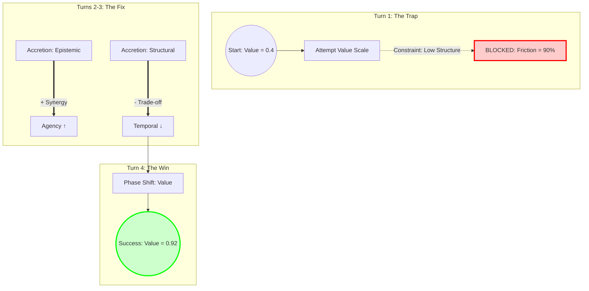

# CASE STUDIES: Applied Dimensional-Transformational Logic

This document details applied scenarios using the D-T Framework. Each case demonstrates the sequence of Transformations required to evolve a mental model from a problem state to a solution state, highlighting the mechanical **Constraints** and **Ripples** involved.

---

## Case Study 1: The Scale-Up Pivot

**Scenario:** A fast-moving B2C startup attempts to pivot to B2B Enterprise Sales.

**The Problem:** The "Move Fast and Break Things" model (High Temporal, Low Structural) fails when selling to banks/hospitals (High Structural requirement).

---

### 1. Initial State Vector (Diagnosis)

| Dimension | Score (0.0-1.0) | Description |
|-----------|-----------------|-------------|
| **Temporal** | 0.9 (High) | Weekly sprints, rapid deployment, hotfixes |
| **Structural** | 0.2 (Low) | Flat hierarchy, "spaghetti code," no documentation |
| **Epistemic** | 0.3 (Low) | Deep B2C knowledge, zero B2B/Compliance knowledge |
| **Relational** | 0.4 (Med) | Loose network of early adopters |
| **Agency** | 0.8 (High) | Founders make all decisions instantly |
| **Value** | 0.4 (Low) | High churn, low LTV |

---

### 2. The Simulation Log (The Pivot Process)

#### 🔴 Turn 1: The Premature Optimization Trap

**Context:** The Board demands immediate revenue growth. The CEO tries to force a Phase Shift on the Value dimension (scaling sales) without changing the underlying model.

**Operator:** `apply("Phase Shift", "value_oriented", intensity=0.5)`

**Engine Logic (ConstraintRegistry):**

```
CHECK: Target value_oriented requires epistemic > 0.5. (Current: 0.3)
CHECK: Target value_oriented requires structural > 0.4 for Enterprise reliability. (Current: 0.2)
RESULT: Friction = 0.9. Transformation Stalled.
```

**Real World Equivalent:** The sales team pitches to Enterprises, but fails Security Audits (SOC2) and Procurement reviews because the product is "too risky."

**Outcome:** Value barely moves (0.4 → 0.41). The CEO is confused why "just adding sales headcount" didn't work.

---

#### 🟡 Turn 2: The Epistemic Foundation

**Context:** The team realizes they don't know how to sell to Enterprise. They hire a VP of Sales and consultants.

**Operator:** `apply("Accretion", "epistemic", intensity=0.4)`

**Engine Logic (RippleEngine):**

```
ACTION: Epistemic 0.3 → 0.7
RIPPLE (Synergistic): Epistemic increase causes Agency (+0.2)
RIPPLE (Synergistic): Epistemic increase causes Value (+0.12)
```

**Real World Equivalent:** Knowledge of the sales cycle gives the team confidence. They stop guessing. The roadmap becomes data-driven.

**Outcome:**

- Epistemic: 0.3 → 0.7
- Agency: 0.8 → 1.0 (maxed out)
- Value: 0.4 → 0.52 (modest gain)

---

#### 🟡 Turn 3: The Structural Trade-off (The Painful Part)

**Context:** To close the deal, they must implement SOC2 compliance, rigid QA testing, and manager layers.

**Operator:** `apply("Accretion", "structural", intensity=0.5)`

**Engine Logic (RippleEngine):**

```
ACTION: Structural 0.2 → 0.7
RIPPLE (Antagonistic): Structural increase causes Temporal (-0.2)
RIPPLE (Synergistic): Structural increase causes Relational (+0.1)
```

**Real World Equivalent:** The "**Bureaucracy Trap**." Weekly sprints become Monthly releases. Devs complain about "red tape." Velocity drops.

> **Insight:** This is a **feature, not a bug**. Enterprise sales requires this trade-off.

**Outcome:**

- Structural: 0.2 → 0.7
- Temporal: 0.9 → 0.7 (velocity loss)
- Relational: 0.4 → 0.5 (better coordination)

---

#### 🟢 Turn 4: The Successful Scale

**Context:** Now that dependencies are met (Epistemic > 0.5, Structural > 0.4), we try the Value shift again.

**Operator:** `apply("Phase Shift", "value_oriented", intensity=0.5)`

**Engine Logic:**

```
CHECK: Constraints met. Friction = 0.0
ACTION: Value 0.52 → 0.92
```

**Real World Equivalent:** The bank signs the contract. ARR jumps 10x. The model has successfully mutated from "Startup" to "Scale-up."

**Final State:**

- Structural: 0.7 (✅ Enterprise-ready)
- Epistemic: 0.7 (✅ Domain expertise)
- Temporal: 0.7 (⚠️ Slower, but acceptable)
- Value: 0.92 (✅ **SUCCESS**)

---

### 3. Visualizing the Transformation



---

### 4. Key Takeaways for Model Engineering

#### ✅ Respect the Physics

You cannot Phase Shift (Scale) a model that has not undergone Accretion (Foundation building). The engine will generate friction.

#### ⚖️ Accept the Trade-offs

You cannot maintain startup speed (High Temporal) while building enterprise reliability (High Structural). The simulation predicts this loss of velocity; plan for it.

#### 🧠 Knowledge First

**Epistemic accretion is the highest leverage move.** It unlocks Agency and Value constraints automatically through ripple effects.

#### 📊 Sequence Matters

The correct transformation order was:

1. **Epistemic** (Learn the domain)
2. **Structural** (Build the foundation)
3. **Value** (Attempt the scale)

Reversing this order (trying Value first) resulted in 90% friction.

---

## Case Study 2: The Agile Transformation (Coming Soon)

**Scenario:** A traditional Waterfall organization attempts to adopt Agile/DevOps.

**Key Dimensions:**

- Temporal (6-month cycles → 2-week sprints)
- Agency (Centralized → Distributed)
- Structural (Hierarchical → Cross-functional teams)

**Predicted Challenges:**

- Antagonistic coupling: Increasing Agency will decrease Relational coherence initially
- Dependency friction: Cannot increase Temporal velocity without first increasing Epistemic (team skill)

---

## Case Study 3: The AI Safety Alignment Problem (Coming Soon)

**Scenario:** Transitioning from "Capability-first" AI to "Alignment-first" AI.

**Key Transformation:** Transmutation of the Value dimension (from "maximize performance" to "minimize harm").

**Predicted Ripples:**

- Structural complexity increases (need for oversight layers)
- Temporal velocity decreases (safety reviews slow deployment)

---

## Running Your Own Case Studies

Use the simulation framework:

```python
from engine.dt_framework import MentalModel

# Define your scenario
model = MentalModel("Your Scenario Name")

# Set initial state
model.dimensions = {
    'structural': 0.2,
    'relational': 0.4,
    'temporal': 0.9,
    'epistemic': 0.3,
    'agency': 0.8,
    'value_oriented': 0.4
}

# Apply transformations sequentially
model.apply("Accretion", "epistemic", intensity=0.4)
model.apply("Accretion", "structural", intensity=0.5)
model.apply("Phase Shift", "value_oriented", intensity=0.5)

# Review outcome
print(model)
model.export_history("my_case_study.json")
```

---

**"You cannot change one variable without vibrating the entire web."**
