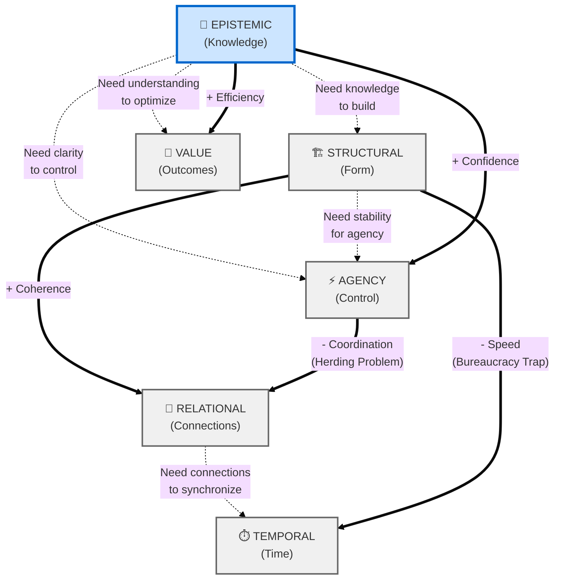

# D-T Framework: Dimensional-Transformational Cognitive Engine

**The mission-critical reasoning engine for Sovereign Intelligence.**

---

## Overview

The D-T Framework is a **hybrid cognitive ontology** that treats mental models not as static templates, but as dynamic systems. It enables "Model Engineering" by mapping **static attributes (Dimensions)** against **dynamic operators (Transformations)** to evolve mental models from low-utility states to high-utility solutions.

---

## The Ontology

### The State Space: 6 Dimensions

A mental model exists as a vector across six axes (normalized 0.0 to 1.0):

| Dimension          | Definition                                                       |
| ------------------ | ---------------------------------------------------------------- |
| **Structural**     | Form & Composition (granularity, modularity)                     |
| **Relational**     | Interactions & Connectivity (topology, causal chains)            |
| **Temporal**       | Time & Dynamics (horizons, stability, cycles)                    |
| **Epistemic**      | Knowledge & Uncertainty (visibility, confidence)                 |
| **Agency**         | Control & Intent (active vs. passive, individual vs. collective) |
| **Value-Oriented** | Outcomes & Leverage (efficiency, resilience)                     |

### The Operators: 8 Transformations

Mechanisms applied to dimensions to mutate the state vector M(t) → M(t+1):

| Transformation      | Effect                                               |
| ------------------- | ---------------------------------------------------- |
| **Accretion**       | Additive build-up (zoom in, add evidence)            |
| **Pruning**         | Subtractive refinement (abstraction, Occam's razor)  |
| **Reconfiguration** | Structural rearrangement (isomorphic shuffle)        |
| **Fusion**          | Integrative merging (synthesis, hierarchy building)  |
| **Bifurcation**     | Divergent branching (scenarios, parallel processing) |
| **Iteration**       | Cyclic refinement (feedback loops)                   |
| **Phase Shift**     | Threshold transformation (linear to non-linear)      |
| **Transmutation**   | Fundamental conversion (ontology shift)              |

---

## The Cognitive Physics

### System Map

**Dependencies (Dotted Lines)** = Prerequisites that cause friction  
**Ripples (Thick Arrows)** = Automatic cascading effects



**🧠 EPISTEMIC (Blue)** = High-leverage node. Optimize knowledge first.

### How to Read This Map

**The High Leverage Node (Blue):** `Epistemic` is highlighted because it has the most outgoing connections. It's a prerequisite for almost everything and generates positive ripples into Agency and Value.

> **Insight:** Always optimize Epistemic (Knowledge) first.

**Dotted Lines (Constraints):** These represent **friction**. If you try to improve Value without sufficient Epistemic foundation, the constraint acts as a gatekeeper, generating resistance.

**Thick Arrows (Ripples):** These represent **automatic cascading changes**:

- `==>` **Synergistic**: Improving Source automatically improves Target
- `==>` **Antagonistic**: Improving Source automatically degrades Target

**Example:** The "Bureaucracy Trap" - Increasing Structural complexity (adding layers) automatically reduces Temporal velocity (slows you down).

---

## Usage Example

```python
from engine.dt_framework import MentalModel

# Initialize a mental model
project = MentalModel("Startup Strategy")

# Phase 1: Research (build knowledge foundation)
project.apply("Accretion", "epistemic", intensity=0.4)

# Phase 2: Simplify (remove unnecessary complexity)
project.apply("Pruning", "structural", intensity=0.2)

# Phase 3: Scale (attempt phase shift)
dims, warning, friction = project.apply("Phase Shift", "value_oriented", intensity=0.5)

# Check results
print(project)  # ASCII visualization
print(f"Friction: {friction:.1%}")

# Export history
project.export_history("transformation_log.json")
```

---

## Key Features

### 1. Dependency Engine (Constraint Registry)

Prevents "illegal moves" in the state space. You cannot build a skyscraper (high Structural) on quicksand (low Epistemic).

**Example Constraint:**

```python
'value_oriented': [
    ('epistemic', 0.5, "Blind optimization is dangerous. Increase Knowledge first.")
]
```

### 2. Ripple Engine (Coupling Registry)

Models realistic systemic behavior. Touching one variable vibrates the entire web.

**Example Coupling:**

```python
'structural': [
    ('temporal', -0.4),   # Bureaucracy Trap: More layers → slower
    ('relational', 0.2)   # Stability Bonus: More structure → better coherence
]
```

### 3. Friction Calculation

Quantifies resistance to change when prerequisites aren't met:

- **0% Friction:** Full transformation applies
- **80% Friction:** Transformation mostly stalled
- **90% Friction:** Maximum resistance (change nearly impossible)

### 4. Recursive Propagation

Ripples cascade through the system with depth limits to prevent infinite loops.

---

## Simulations

See `/simulations/` for working examples:

- **`phoenix.py`** - Demonstrates premature optimization and dependency friction
- **`corporate_bloat.py`** - Shows ripple effects and bureaucracy trap

---

## Architecture

```
dt_framework/
├── mental_model.py      # Core MentalModel class
├── constraints.py       # ConstraintRegistry, CouplingRegistry, TransformationLogic
├── simulations/         # Example scenarios
│   ├── phoenix.py
│   └── corporate_bloat.py
└── README.md           # This file
```

---

## Integration with Sovereign Intelligence

The D-T Framework serves as the **cognitive reasoning engine** for the Sovereign Intelligence Stack:

```
[User Request] → [Constitution Audit] → [D-T Reasoning] → [Model Selection] → [Output]
```

It enables the system to:

- Reason about complex strategic decisions
- Model dependencies and trade-offs
- Simulate outcomes before execution
- Provide transparent decision rationale

---

## Next Steps

- **Case Studies:** Real-world scenarios (Startup Pivots, Agile Migrations, etc.)
- **UI Integration:** Visualize transformations in real-time
- **Constitutional Hooks:** Link D-T Framework to sovereign.py auditing logic

---

**"Code Rot is inevitable. Context is eternal. Structure accordingly."**
